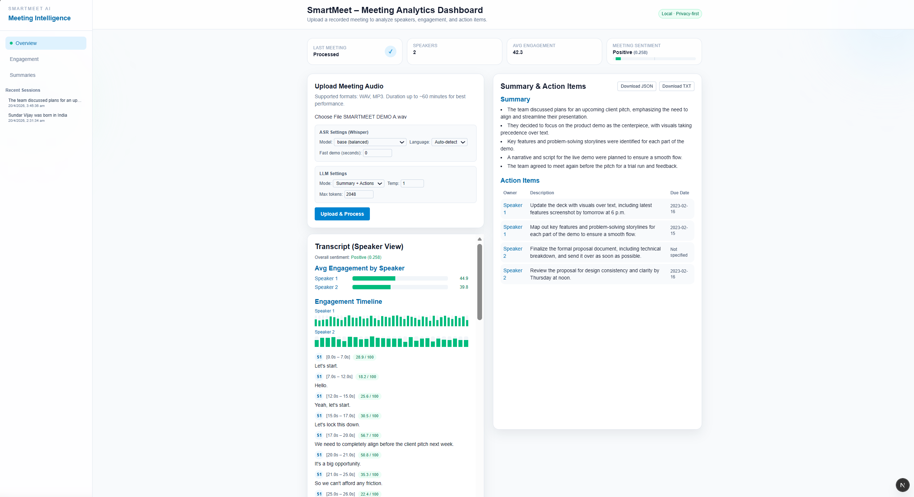

# SmartMeet AI

SmartMeet AI is a small meeting-intelligence tool I built to turn raw meeting audio into something actually useful: a clean transcript, speaker-wise engagement, and AI-generated summaries and action items.

The goal was to keep everything local (no cloud APIs) and still get a decent “AI meeting assistant” experience for college projects, demos, and internal discussions.

---

## Features

- **Speech-to-text with Whisper (local)**
  - Transcribes uploaded audio files to text using `faster-whisper`.
  - Optional language selection (`auto`, `en`, `hi`, `mr`) and time limit for quick demos.

- **Simple speaker diarization**
  - Uses timestamps to group turns and assign `Speaker 1`, `Speaker 2`, etc.
  - Not perfect diarization, but good enough for small meetings.

- **Engagement scoring**
  - Computes a rough engagement score per segment and per speaker based on:
    - Speaking duration
    - RMS loudness
    - Words per second

- **Sentiment analysis**
  - Estimates overall meeting sentiment (Positive / Neutral / Negative) from the transcript.

- **Local LLM summaries & action items**
  - Sends the labeled transcript to a local Ollama model (`llama3.1:8b`).
  - Returns a JSON summary and a list of action items (owner, description, optional due date).

- **Modern dashboard UI (Next.js)**
  - Upload audio, tweak ASR/LLM settings, and view:
    - Transcript with speaker labels
    - Engagement timeline per speaker
    - Summary + action items table
  - Export the results as JSON or plain text.

---

## Tech Stack

**Backend**

- Python, FastAPI
- `faster-whisper` for speech-to-text
- `TextBlob` for sentiment analysis
- `soundfile`, `numpy` for basic audio features
- Ollama + `llama3.1:8b` for local LLM summaries

**Frontend**

- Next.js (App Router)
- React, TypeScript
- Tailwind CSS for styling
- Simple localStorage-based “Recent Sessions” history

Everything is designed to run locally on a developer machine (no external APIs required).

---

## Project Structure

```text
SmartMeetAI/
├── backend/
│   └── main.py          # FastAPI app: ASR, sentiment, engagement, LLM call
├── frontend/
│   ├── app/             # Next.js app (layout, page)
│   ├── public/          # Icons, SVGs
│   ├── package.json
│   └── ...              # usual Next.js config files
└── .gitignore
```

## Screenshot




---

## Running the backend (FastAPI)

### 1. Create and activate a virtual environment

From the project root:

```bash
cd backend

# create venv (Python 3.x)
python -m venv .venv
# Windows
.venv\Scripts\activate
# Linux/macOS
source .venv/bin/activate
```

### 2. Install dependencies

```bash
pip install -r requirements.txt
```

(If you don’t have a `requirements.txt` yet, you can generate one later with `pip freeze > requirements.txt`.)

### 3. Make sure Ollama is running

- Install Ollama from: https://ollama.com
- Pull the model once:

```bash
ollama pull llama3.1:8b
```

- Make sure the Ollama server is running on `http://localhost:11434`.

### 4. Start the FastAPI server

From `backend/`:

```bash
uvicorn main:app --reload --port 8000
```

The API will be available at:

- `POST http://127.0.0.1:8000/process-meeting`

---

## Running the frontend (Next.js)

From the project root:

```bash
cd frontend
npm install
npm run dev
```

By default, the app runs on:

- `http://localhost:3000`

The frontend is already wired to call the backend at `http://127.0.0.1:8000/process-meeting`, so as long as both servers are running, you can:

1. Open the dashboard in the browser.
2. Upload an audio file (WAV/MP3).
3. Adjust ASR/LLM settings if needed.
4. Click **“Upload & Process”** to see the analysis.

---

## Notes / Limitations

- Speaker diarization is a simple heuristic.
- Engagement scores are approximate and meant for visualization, not scientific metrics.
- Long meetings and heavier Whisper models will need more CPU/GPU.

This project is mainly for learning and showcasing how to wire together ASR, basic audio analytics, and local LLMs into a single end-to-end app.
